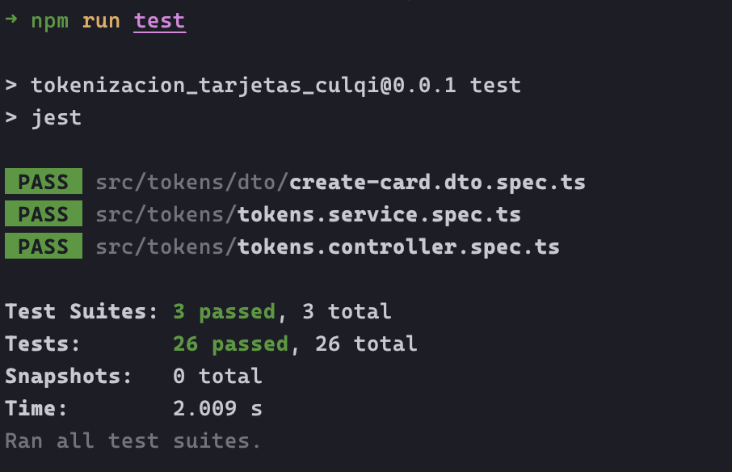

Documentación de uso

## Requisitos

- Node.js 18
- Minikube
- Kubectl

## Instalación

Instalar [AWS CLI](https://aws.amazon.com/es/cli/) y luego configurar una cuenta de AWS.
```bash
# Configure sus credenciales:
$ aws configure
# Instalando dependencias
$ npm install
```

Instalar [Minikube](https://minikube.sigs.k8s.io/docs/start/).
```bash
# Encender Minikube
$ minikube start
# Revisar estado
$ minikube status
```

Instalar [Kubectl](https://kubernetes.io/docs/tasks/tools/).


## Ejecución
```bash
# Estar en el proyecto y mandar las los yaml a Kubernetes
$ kubectl apply -f kube
# Verificar si pasaron correctamente
$ kubectl get pods --watch
# Ingresar al servicio llamado tokens
$ minikube service tokens --url
# Se generará un Link del API
```

## Pruebas unitarias
Para ejecutar pruebas ingresar el siguiente comando
```bash
$ npm run test
```


## Extra

Documentación en [Postman](https://documenter.getpostman.com/view/11052226/2s8ZDU4PNt#0ff1ad78-cf25-443b-ad3d-48248cdcc314)

https://documenter.getpostman.com/view/11052226/2s8ZDU4PNt#0ff1ad78-cf25-443b-ad3d-48248cdcc314
